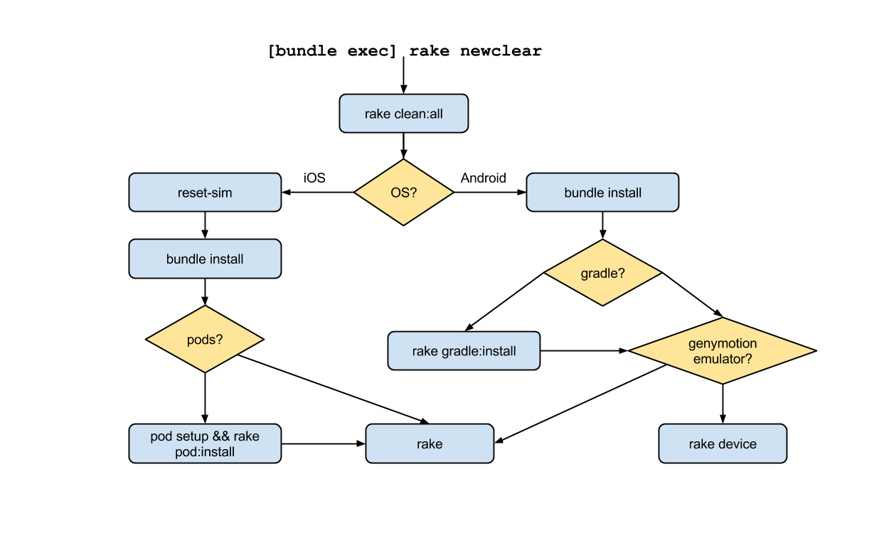

**newclear**  - Your one line and relax solution to a ground up rebuild of your iOS or Android RubyMotion app.

## Why?
Sometimes a build gets _FUBAR_.   When you run `rake newclear` it builds your project from the ground up without you having to interact at each step in the rebuild process.  _Just type and chillax._  **We simplify the clean-up to a memorable and automated task.**

## Usage
**newclear** comes with 4 helpful rake tasks _but..._
**99% of the time you want to run** `rake newclear`.

### :crown: `[bundle exec] rake newclear`

The most common and useful command.  `newclear` gives you a new and clear run of your build.  All assets cleaned out and then built in the correct order!  This is great for kicking off the rebuild to clear any cruft that might be crashing your app.

This runs our `nuke` task and then `rake` (`rake device` for android if you have no emulator running).  Ergo, anything run with newclear is like running on a fresh machine.

### How does it all work?

Just kidding.  If you want to trace the logic, here you go!

## Ancillary Rake Tasks

#### `[bundle exec] rake newb`

Sometimes helpful, `newb` gives you a new build of your app.  This is excellent for clearing out data before a test, or making sure your application is built in the correct order.

This runs our `nuke` task and then `rake build:simulator`.

#### `[bundle exec] rake nuke`

Useful for preparing the build, the `nuke` task clears everything from previous builds and fetches fresh resources in the correct order.  After a nuke, you can be sure that your next build is ready to go.

This will start off with a complete `rake clean:all` which removes all compiled builds.  We then do a speedy `bundle install` (3 jobs) as your RM resources must be in place before any 3rd party dependencies.  Lastly, we verify if you're using pods/gradle and install dependencies appropriately.

#### `[bundle exec] rake newclear:debug`

`newclear:debug` gives you the detected parameters of your setup.  If you have _any_ complication with newclear, be sure to use this to makes sure newclear is detecing your system setup correctly.

## Install

Add this line to your application's Gemfile:

    gem 'newclear'

And then execute:

    $ bundle

Or install it yourself as:

    $ gem install newclear

## Dependency
We're using Rickert's lovely `reset-sim` gem in our nuke (when dealing with iOS).   So be sure to have accessibility turned on for your terminal, as suggested on [the gem's github page](https://github.com/OTGApps/reset-sim#usage)

## Contributing

1. Fork it
2. Create your feature branch (`git checkout -b my-new-feature`)
3. Commit your changes (`git commit -am 'Add some feature'`)
4. Push to the branch (`git push origin my-new-feature`)
5. Update the flow-chart if applicable [Flow-Chart](https://docs.google.com/drawings/d/1U7gq40TGMi5t8DkBAEfOB57SnjkfiKTRCUdfRtTAaWo/edit?usp=sharing)
6. Hula hoop and down a beer in under a minute.
7. Create new Pull Request
